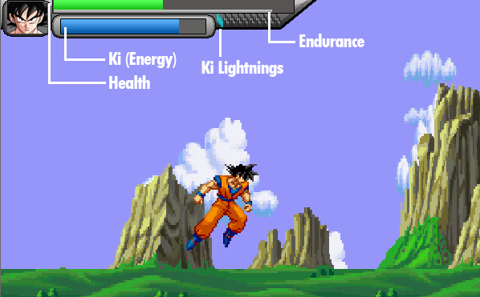

See it in action: https://www.youtube.com/watch?v=OzUPiuepd0Q

## How to play

Download and extract newest zip from Releases (https://github.com/Rolleander/dragonsmashballz/releases).

The software does not need installation, everything is contained in the folder.

Settings and save data is stored under *BRollGames\DragonSMASHBall* in your user folder. 

### Controls

Controls are all changable in the menu. The default controls for keyboard are (Player 1):

Basic controls | Key
------------ | -------------
**Movement** | ← / ↑ / ↓ / →  (Arrow keys)
**Attack** | A
**Loading Ki (Energy)** | S
**Defence / Block** | D
**Special Action / Skill** | W

The basic controls can be combined to perform advanced moves, most of these require Ki (Energy):

Combos | Key  | Requirement
------------ | ------------- | -------------
**Fast Movement** | ← / ↑ / ↓ / → + S | Drains energy while using
**Attack Up / Down** | A + ↑ or A + ↓  | 
**Shoot energy particle (Ki attack)** | S + A | Small amount of energy
**Special attack** | S + D | Half Ki bar
**Ultimate attack** | A + D | Full Ki bar (must have white border)
**Charge Ki lightning** | W + ↓  | Medium amount of energy. 
**Transform** | W + ↑  | Full Ki bar (must have white border) and character must have a transformation

When using a gamepad, the ← / ↑ / ↓ / → keys are mapped to the joystick. 
Gamepads can assign two extra buttons for simplified triggering of the Special and ultimate attack, 
but the combos can still be activated with the existing button combinations.

Furthermore there are some hidden mechanics like heavy/speed attacks and dragon teleports. 
You can figure them out by trying or looking at the code (not recommended) :)

### Battle Overlay

- **Health** : If it reaches 0, you lose 
- **Ki (Energy)** : Required for lots of special moves, can be filled with the Ki-Charging move
- **Ki Lightnings**: They greatly increase the power (and in some cases the size) of your next ultimate attack. 
- **Endurance** : Taking a beating will reduce your endurance, if it reaches 0 your fighter will be stunned for a while. Re-fills automatically. 

Some fighters are cyborgs and behave slightly different. A cyborg can not charge Ki, so your Ki charging move will do nothing. Cyborgs Ki will slowly fill automatically and you can fill it faster by attacking the enemy. 

### Cheats

Fighters and items have to be unlocked with the in-game currency (Zeni). 

Items can be bought and given to characters, but do not have an effect on the fights yet (Unfinished feature).

If you dont feel like unlocking, here are some cheats that can be typed while being in the menu:

Cheatcode | Effect
------------ | -------------
**helpmegoku** | Unlock all fighters
**thxvegeta** | Lock all fighters (except the starting fighters)
**capsulecorp** | Unlock all items
**itsover9000** | +99999 Zeni

## General information

I started working on this game in highschool with not much experience in programming before. Hence the code quality is really poor.
Since it was a project to learn programming games I did use existing libraries sparely and tried to implement everything myself with standard java classes.

The game core was finished but at some point I lost myself in adding more and more new features. Some of the new things were never finished or do not work completely yet. 
However, it is in a playable state. 

## How to contribute 

Clone/Fork the project, commit your changes and open a pull request for me to merge. 
Ill try to answer questions when I have time, so just contact me.

The project is self-contained and uses no build tools. 
It should be edited with eclipse by selecting Import > Existing projects into workspace.

### The (horrible) codebase

For the brave people wanting to work with this project, here is some starting information:

#### Libraries / Frameworks

There are only a few used:

- Java Swing: For the game container, however it just contains an empty JPanel with a customized paint method that renders the whole game.
- JInput: For connecting gamepads 
- Jogg / Jorbis: To play music / sounds

#### Code quality

Started as a monolith and then slowly used more concepts of OOP. 
The old parts are really hard to read since I didnt know about Lists and was using Arrays for everything. 
Lots and lots of magic numbers all over the place so its easy to break the whole thing without noticing.
Some parts of the code are sadly in german, most of the variables and methods should be in english.
Naming is often confusing and not straightforward, no code standards were regarded.
Keep in mind this is code written by a Kiddo teaching himself programming with learning by doing (mostly just doing haha).

#### Structure

Even if its not the greatest, at least there is some package structure.
The project originated in **DBZ/** and thats also where the Main class is located.
Different resources are kept in different folders all over the workspace:

- **Charactersounds/** Fighter sounds
- **DBZ/Maps/** Stage pictures
- **DBZ/Ressourcen/** Most graphics for the menu and stuff
- **FX/** Other game sounds
- **Music/** Game music

Credits to the resources I used can be looked up in the credits menu in-game or by reading the file **DBZ/Ressourcen/Credits.txt**.

